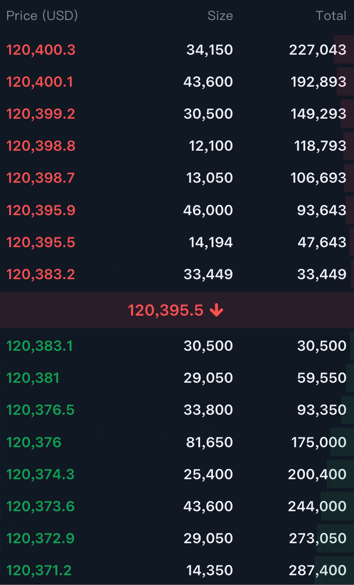

# Key features
1. Real-time WebSocket expertise with sequence validation
2. Performance optimization with 50ms update cycles
3. Modern React patterns with custom hooks and TypeScript
4. State management with Zustand and complex data pipelines

# Demo

